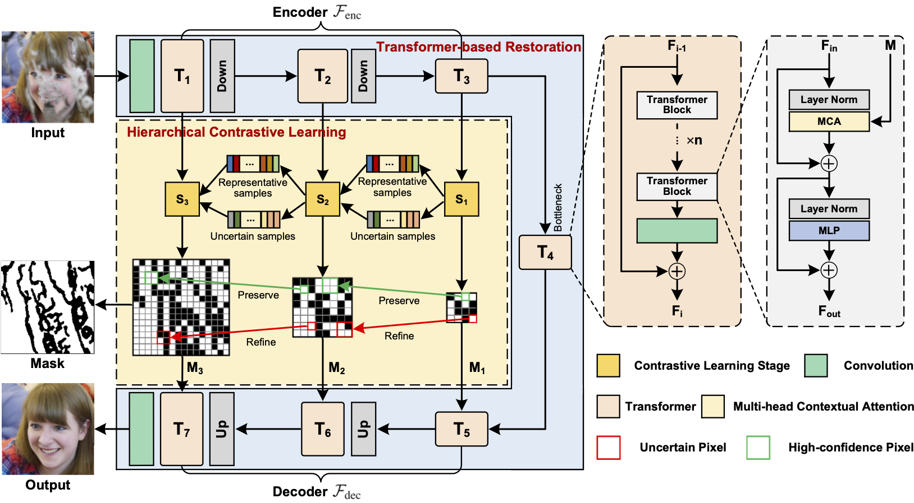

# Hierarchical-Contrastive-Learning-Corruption-Detection

Codebase of ICCV 2023 paper "Hierarchical Contrastive Learning for Pattern-Generalizable Image Corruption Detection".


## Overall Framework




## Installation

1. Clone this repo:

   ```shell
   git clone https://github.com/xyfJASON/Hierarchical-Contrastive-Learning-Corruption-Detection.git
   cd Hierarchical-Contrastive-Learning-Corruption-Detection
   ```

2. Create and activate a conda environment:

   ```shell
   conda create -n HCL python=3.10
   conda activate HCL
   ```

3. Install pytorch from https://pytorch.org, for example:

   ```shell
   pip install torch==1.12.1+cu116 torchvision==0.13.1+cu116 --extra-index-url https://download.pytorch.org/whl/cu116
   ```

4. Install required packages:

   ```shell
   pip install -r requirements.txt
   ```


## Datasets Preparation

We use [CelebA-HQ](https://github.com/tkarras/progressive_growing_of_gans), [FFHQ](https://github.com/NVlabs/ffhq-dataset), [ImageNet](https://image-net.org/) and [Places365](http://places2.csail.mit.edu/) datasets in our experiments.

- **CelebA-HQ**: Download CelebAMask-HQ dataset from the [official repo](https://github.com/switchablenorms/CelebAMask-HQ). Unzip the downloaded file. Put `./scripts/celebahq_map_index.py` under the unzipped directory and run the script. It will change the name of the images to match the index in the original CelebA dataset.
- **FFHQ**: Download FFHQ dataset from the [official repo](https://github.com/NVlabs/ffhq-dataset). We only need the [images1024x1024](https://drive.google.com/open?id=1tZUcXDBeOibC6jcMCtgRRz67pzrAHeHL) part. No post-processing is needed.
- **ImageNet**: Download ImageNet dataset (ILSVRC 2012) from the [official website](https://image-net.org/challenges/LSVRC/2012/2012-downloads.php). No post-processing is needed.
- **Places365**: Download Places365-Standard from the [official website](http://places2.csail.mit.edu/index.html). No post-processing is needed.

We use **NVIDIA Irregular Mask Dataset** in our experiments, which can be downloaded from the [official website](https://nv-adlr.github.io/publication/partialconv-inpainting). To avoid heavy computation in transforming the masks during training, we use this dataset in a way similar to [EdgeConnect](https://github.com/knazeri/edge-connect/issues/28#issuecomment-456440064). To do so, put `./scripts/make_irregular_dataset.py` under the unzipped directory and run the script. It will augment and split the original "testing set" into new training split and test split.

After downloading and processing the datasets, set the `dataroot` in the [configuration files](./configs) to your downloaded path.


## Pretrained Weights

The pretrained models and config files are provided as follows:

| dataset  | pretrained weights | config file |
| :------: | :----------------: | :---------: |
|   FFHQ   |                    |             |
| ImageNet |                    |             |
|  Places  |                    |             |


## Training

The training process contains two phases:

**First phase training**:

```shell
torchrun --nproc_per_node 4 train.py -c ./configs/xxxxx.yml -p 1
```

**Second phase training**:

```shell
torchrun --nproc_per_node 4 train.py -c ./configs/xxxxx.yml -p 2 \
    --train.pretrained /path/to/checkpoint/of/first/phase.pt \
    --train.n_steps 100000
```

**Downstream tasks finetuning** (e.g., watermark removal on LOGO-30K dataset):

```shell
torchrun --nproc_per_node 2 train.py -c ./configs/xxxxx.yml -p 2 \
    --downstream \
    --data.name LOGO-30K \
    --data.dataroot /path/to/dataroot/ \
    --train.pretrained /path/to/pretrained/checkpoint.pt
```


## Testing

**Evaluate**:

```shell
torchrun --nproc_per_node 4 test.py evaluate -c /path/to/config/file.yml \
    --test.pretrained /path/to/checkpoint/of/trained/model.pt \
    --mask.dir_path /path/to/irregular/mask/dataset/test/split
```

**Sample**:

```shell
python test.py sample -c /path/to/config/file.yml \
    --test.pretrained /path/to/checkpoint/of/trained/model.pt \
    --test.n_samples {number of samples} \
    --test.save_dir /directory/to/save/the/results/ \
    --mask.dir_path /path/to/irregular/mask/dataset/test/split
```


## Citation

If you find this work useful for your research, please cite:

```
@InProceedings{hierarchical_2023, 
  author = {Xin Feng, Yifeng Xu, Guangming Lu, Wenjie Pei},
  title = {Hierarchical Contrastive Learning for Pattern-Generalizable Image Corruption Detection}, 
  booktitle = {Proceedings of the IEEE/CVF International Conference on Computer Vision (ICCV)}, 
  month = {October}, 
  year = {2023}
}
```

